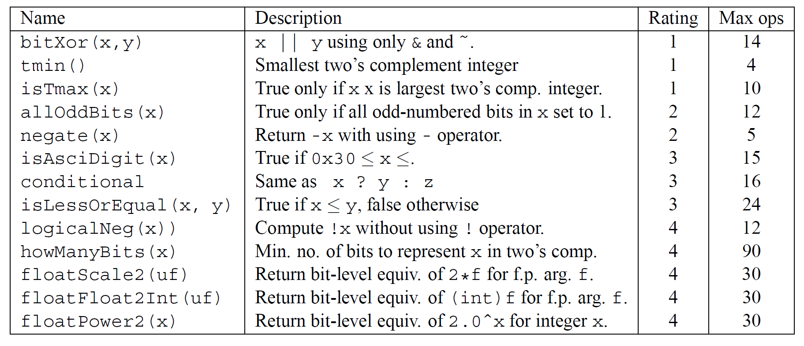
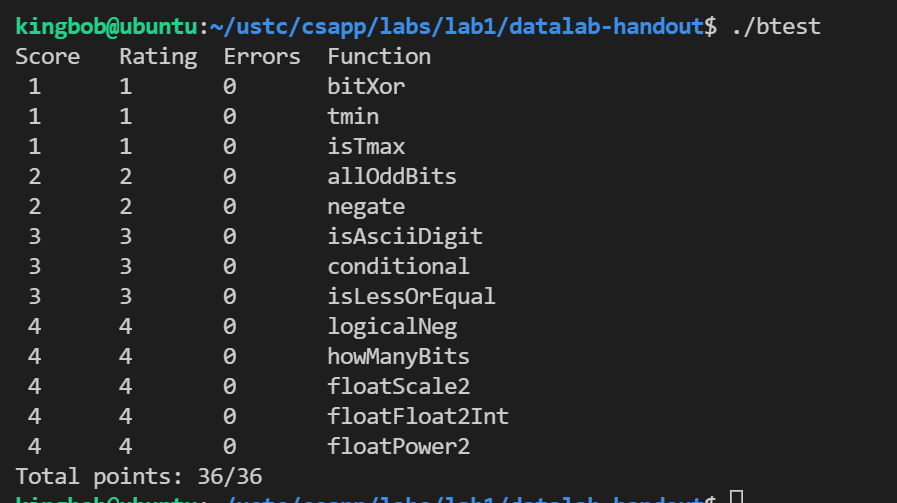
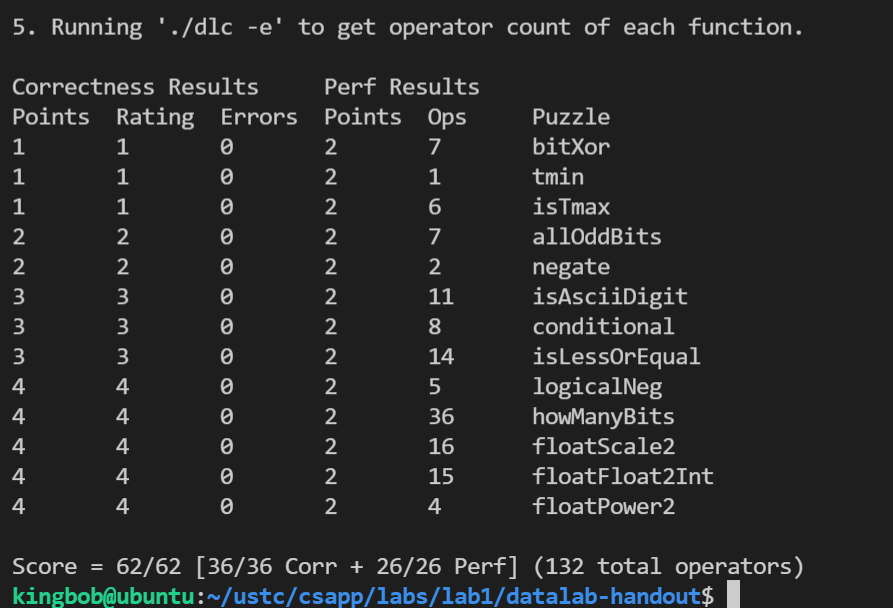

# CSAPP第一次实验：Data Lab


## 一、实验说明

共13道位运算编程题，但是有如下编码要求：

```c
  You are expressly forbidden to:
  1. Use any control constructs such as if, do, while, for, switch, etc.
  2. Define or use any macros.
  3. Define any additional functions in this file.
  4. Call any functions.
  5. Use any other operations, such as &&, ||, -, or ?:
  6. Use any form of casting.
  7. Use any data type other than int.  This implies that you
     cannot use arrays, structs, or unions.

 
  You may assume that your machine:
  1. Uses 2s complement, 32-bit representations of integers.
  2. Performs right shifts arithmetically.
  3. Has unpredictable behavior when shifting if the shift amount
     is less than 0 or greater than 31.
```

1. 不能使用控制语句（`if`、`do`、`while`、`for`、`switch`等）
2. 不能定义和使用宏
3. 不能定义和调用额外的函数
4. 不能使用除`& ^ | + << >> ! ~`外的其他操作，如`&&, ||, -, or ?:`等等
5. 不能使用任何形式的类型转换
6. 不能使用除`int`类型外的其他数据类型




## 二、实验内容

### 2.1 bitXor

```c
/* 
 * bitXor - x^y using only ~ and & 
 *   Example: bitXor(4, 5) = 1
 *   Legal ops: ~ &
 *   Max ops: 14
 *   Rating: 1
 */
int bitXor(int x, int y) {
    return (~(~x & ~y)) & (~(x & y));
}
```

第一题实现按位异或`^`，解题思路：

对于异或的算法：`x^y=(~x&y)|(x&~y)`，但不能使用`|`，所以需要借助`~`和`&`来替换，而类似于集合运算：

$C(X \cup Y)=CX \cap CY$，C表示补集，可以得到`~(x|y)=~x & ~y`，所以`x|y=~(~x & ~y)`，因此`x^y=(~x&y)|(x&~y)=~(~(~x&y)&~(x&~y))`。


### 2.2  tmin

```c
/*
 * tmin - return minimum two's complement integer 
 *   Legal ops: ! ~ & ^ | + << >>
 *   Max ops: 4
 *   Rating: 1
 */
int tmin(void) {
    return 1 << 31;
}
```

第二题返回补码定点数的最小值，此题显然。


### 2.3 isTmax

```c
/*
 * isTmax - returns 1 if x is the maximum, two's complement number,
 *     and 0 otherwise 
 *   Legal ops: ! ~ & ^ | +
 *   Max ops: 10
 *   Rating: 1
 */
int isTmax(int x) {
    int y = x + 1;
    x += y;
    x = ~x; //if x!=-1, then !x is the right answer.
    //if y==0, it means x=-1, then !y=1, and if y!=0,then !y=0, (x+y)=x
    y = !y;
    x += y;
    return !x;
}
```

第三题判断给定整数是否是补码定点数最大值。

解题思路：

1. 首先需要明确这个函数只返回`1`或`0`，而可使用的操作符中只有`!`操作符可以返回`1`或`0`，所以最后返回的形式一定是某个`0`或非`0`的数作为中间结果。
2. 设补码定点数最大值为`Tmax=0x7fffffff`，显然`Tmax+1=Tmin=0x80000000`，所以`Tmax+(Tmax+1)=0xffffffff`对其取按位反可得到全`0`，最后取`!`即为正确答案。
3. 但是需要注意到`-1`的补码为全`1`，所以需要排除`-1`这种情况。
4. 令`y=x+1`，使用`!y`来判断`x`是否是`-1`，如果`x=-1`，那么`y=0, !y=1`，则利用`x+=y`是否破坏`x`的值来判断。
5. 返回`!x`


### 2.4  addOddBits

```c
/*
 * allOddBits - return 1 if all odd-numbered bits in word set to 1
 *   where bits are numbered from 0 (least significant) to 31 (most significant)
 *   Examples allOddBits(0xFFFFFFFD) = 0, allOddBits(0xAAAAAAAA) = 1
 *   Legal ops: ! ~ & ^ | + << >>
 *   Max ops: 12
 *   Rating: 2
 */
int allOddBits(int x) {
    int mask = 0xAA;
    mask = mask + (mask << 8);
    mask = mask + (mask << 16);
    return !(mask ^ (mask & x));
}
```

第四题判断一个整数所有奇数位是否为`1`，满足则返回`1`否则返回`0`

解题思路：

1. 本题如果用`!((0xAAAAAAAA)^(0xAAAAAAAA & x))`可直接判断，但由于datalab有限制：只能使用大小在`0~255`范围内的整数，因此需要构造这个**掩码**。
2. 构造`0xAAAAAAAA`就是使用`0xAA`进行移位相加的操作，如上所示。


### 2.5 negate

```c
/*
 * negate - return -x 
 *   Example: negate(1) = -1.
 *   Legal ops: ! ~ & ^ | + << >>
 *   Max ops: 5
 *   Rating: 2
 */
int negate(int x) {
    return (~x) + 1;
}
```

此题返回补码定点数的相反数，为基础知识，解答略。


### 2.6 isAsciiDigit

```c
/* 
 * isAsciiDigit - return 1 if 0x30 <= x <= 0x39 (ASCII codes for characters '0' to '9')
 *   Example: isAsciiDigit(0x35) = 1.
 *            isAsciiDigit(0x3a) = 0.
 *            isAsciiDigit(0x05) = 0.
 *   Legal ops: ! ~ & ^ | + << >>
 *   Max ops: 15
 *   Rating: 3
 */
int isAsciiDigit(int x) {
    //
    int y, z;
    y = 10;
    z = x;
    z = z >> 4;
    z = z ^ 3;
    z = z << 4; //z is the higher 28 bit of x, z should be 0;
    x = x & 0xF; //now x is the lower 4 bit of the original x;
    x = x + (~y) + 1; //if x - 9 >=0, then the highest bit of x is 0;
    //          we shouldn't use x-10 <0, beacase x might be 0;
    x = x >> 31; //x should be 1;
    x = !x + z;
    return !x;
}
```

此题判断`x`是否是数字`0~9`的`ASCII`码值。

解题思路：

这题我是通过判断`x`的低4位是否小于10，和第4-7位是否等于3来判断的。首先取`x`的第4-7位判断是否等于3，再取`x`的低四位赋予`x`（`x = x & 0xf`），如果`x`满足条件，那么`x`减去10的符号位一定是1，但函数返回结果需要是`0`或`1`，所以这里做了一点小处理，返回`!(!x +z)`，正确返回情况应该是`x=1, z=0`，此时函数可以返回1，其余情况皆只能返回0。


### 2.7 conditional

```c
/*
 * conditional - same as x ? y : z 
 *   Example: conditional(2,4,5) = 4
 *   Legal ops: ! ~ & ^ | + << >>
 *   Max ops: 16
 *   Rating: 3
 */
int conditional(int x, int y, int z) {
    x = !!x;  //ifx==0. then x = 1, else x = 0
    x = (~x) + 1; //if x==0, then -x=0, else if x==1, -x=-1, which means x is all 1s;
    return (x & y) | ((~x) & z);
}
```

此题实现`x?y:z`三元运算符。

解题思路：

`x ? y : z`表示`x==1`时返回`y`，`x==0`时返回`1`。所以当`x!=0`时将`x`转化为全1，当`x==0`时将`x`转化为全0，这样会方便最后结果的返回，通过`&`和`|`即可按照正确的返回形式返回（`(x & y) | ((~x) & z)`）；借助两次`!`可以将`x`转化为0或1的形式，再取反则转换成全1或全0。


### 2.8  isLessOrEuqal

```c
/*
 * isLessOrEqual - if x <= y  then return 1, else return 0 
 *   Example: isLessOrEqual(4,5) = 1.
 *   Legal ops: ! ~ & ^ | + << >>
 *   Max ops: 24
 *   Rating: 3
 */
int isLessOrEqual(int x, int y) {
    int a, sign;
    int sx = x >> 31;
    int sy = y >> 31;
    int z = y + (~x) + 1; //z should be 1 if not overflow, convert to !(y - x < 0)
    sign = sx ^ sy;
    z = z >> 31;
    a = sign & sy; //if a==0, return 1, if a==1, return 0, else
    return (sign & (!a)) | ((!sign) & (!z));
}
```

此题实现小于等于的判断。

解题思路：

我通过判断`!(y - x < 0)`来判断`x <= y`的；`x`和`y`的符号有三种情况：同号、一正一负、一负一正，如果是一负一正则直接返回1，如以上代码所示：`sx`表示`x`的符号，`sy`表示`y`的符号，`sign`表示`x`、`y`是否异号，`a=sign & sy`可以用来判断异号情况下`y`的正负情况，最后返回语句中`(sign & (!a))`即用来处理符号问题；令`z`为`y - x`，再判断`z`的符号即可；最后返回语句后半部分`((!sign) & (!z))`即用来处理`x、y`同号情况。

### 2.9 logicalNeg

```c
/* 
 * logicalNeg - implement the ! operator, using all of 
 *              the legal operators except !
 *   Examples: logicalNeg(3) = 0, logicalNeg(0) = 1
 *   Legal ops: ~ & ^ | + << >>
 *   Max ops: 12
 *   Rating: 4 
 */
int logicalNeg(int x) {
  int sign = (x >> 31) & 1;
  int TMAX = ~(1 << 31);
  return (sign ^ 1) & ((((x + TMAX) >> 31) & 1) ^ 1);
}
```

此题实现`!`运算符。

解题思路：

`!x`：当`x==0`时返回1，否则返回0；只有0会返回1，所以`x`为负数则直接返回0，但`x`为正数时，所有正数加上`Tmax`都会溢出为负数，0则不会，所以最后判断加上`Tmax`之后的符号位即可。

### 2.10 howmanyBits

```c
/* howManyBits - return the minimum number of bits required to represent x in
 *             two's complement
 *  Examples: howManyBits(12) = 5
 *            howManyBits(298) = 10
 *            howManyBits(-5) = 4
 *            howManyBits(0)  = 1
 *            howManyBits(-1) = 1
 *            howManyBits(0x80000000) = 32
 *  Legal ops: ! ~ & ^ | + << >>
 *  Max ops: 90
 *  Rating: 4
 */
int howManyBits(int x) {
    int b16, b8, b4, b2, b1, b0;
    int sign = x >> 31;
    x = (sign & ~x) | (~sign & x);//如果x为正则不变，否则按位取反（这样好找最高位为1的，原来是最高位为0的，这样也将符号位去掉了）

// 不断缩小范围
    b16 = !!(x >> 16) << 4;//高十六位是否有1
    x = x >> b16;//如果有（至少需要16位），则将原数右移16位
    b8 = !!(x >> 8) << 3;//剩余位高8位是否有1
    x = x >> b8;//如果有（至少需要16+8=24位），则右移8位
    b4 = !!(x >> 4) << 2;//同理
    x = x >> b4;
    b2 = !!(x >> 2) << 1;
    x = x >> b2;
    b1 = !!(x >> 1);
    x = x >> b1;
    b0 = x;
    return b16 + b8 + b4 + b2 + b1 + b0 + 1;//+1表示加上符号位
}
```

此题计算用补码表示`x`所需要的最小位数。

解题思路：

这题实在没想出来，又不想用暴力解法，所以参考了网上的做法：如果是一个正数，则需要找到它最高的一位（假设是`n`）是1的，再加上符号位，结果为`n+1`；如果是一个负数，则需要知道其最高的一位是0的（例如4位的1101和三位的101补码表示的是一个值：-3，最少需要3位来表示）。利用了二分法的巧妙思想。


### 2.11 floatScale2

```c
/* 
 * floatScale2 - Return bit-level equivalent of expression 2*f for
 *   floating point argument f.
 *   Both the argument and result are passed as unsigned int's, but
 *   they are to be interpreted as the bit-level representation of
 *   single-precision floating point values.
 *   When argument is NaN, return argument
 *   Legal ops: Any integer/unsigned operations incl. ||, &&. also if, while
 *   Max ops: 30
 *   Rating: 4
 */
unsigned floatScale2(unsigned uf) {
    unsigned e = (uf >> 23) & 0xff; //expoent
    if (e == 255) //uf = 0 or uf is infinity or NaN
    {
        return uf;
    }
    if (e == 0) //denormalized
    {
        return (uf << 1) | (uf & (1 << 31));
    }
    e = e + 1;
    if (e == 255) //2*uf is infinity
    {
        return (uf & 0xff800000) | (e << 23);

    }
    return (uf & 0x807fffff) | (e << 23);
}
```

此题返回浮点数乘2的无符号数表示。

解题思路：

这题也许要分情况讨论：

1. 如果`x=0`，则直接返回0
2. 如果`x=inf, NaN`，则直接返回`x`
3. 如果`x`是非规划化数，由于尾数不隐含1，所以直接将其除去符号位整体左移一位即可
4. 其余情况则只需将`x`的阶码加一


### 2.12 floatFloat2Int

```c
/*
 * floatFloat2Int - Return bit-level equivalent of expression (int) f
 *   for floating point argument f.
 *   Argument is passed as unsigned int, but
 *   it is to be interpreted as the bit-level representation of a
 *   single-precision floating point value.
 *   Anything out of range (including NaN and infinity) should return
 *   0x80000000u.
 *   Legal ops: Any integer/unsigned operations incl. ||, &&. also if, while
 *   Max ops: 30
 *   Rating: 4
 */
int floatFloat2Int(unsigned uf) {
    int sign = 1 << 31;
    int exp = ((uf >> 23) & 0xff) - 127; //real exponent
    int frac = (uf & 0x007fffff) | 0x00800000; //frac=1.M total bits=24
    int result;
    if (exp < 0) //if uf=0 or exponent < 0
    {
        return 0;
    }
    if (exp > 31) {
        return 0x80000000;
    }
    if (exp > 23) {
        result = frac << (exp - 23);
    } else {
        result = frac >> (23 - exp);
    }
    return (uf & sign) ? -result : result;
}
```

此题将浮点数转化为整型，并以无符号整数形式返回。

解题思路：

首先分割浮点数，取出符号位、阶码、尾数，并将阶码转换为十进制形式，将尾数转化为含有隐含1的整数形式（尾数只有23位，一定可以用`int`表示），再分类讨论：

1. 如果指数小于0则直接返回0，向下取整。
2. 如果指数大于31，则显然溢出，则按题目要求返回。
3. 其余情况则直接将尾数左移或者右移相应的位数，因为尾数转换时已经默认左移了23位，所以这里需要进行相应的处理。


### 2.13 floatPower2

```c
/*
 * floatPower2 - Return bit-level equivalent of the expression 2.0^x
 *   (2.0 raised to the power x) for any 32-bit integer x.
 *
 *   The unsigned value that is returned should have the identical bit
 *   representation as the single-precision floating-point number 2.0^x.
 *   If the result is too small to be represented as a denorm, return
 *   0. If too large, return +INF.
 * 
 *   Legal ops: Any integer/unsigned operations incl. ||, &&. Also if, while 
 *   Max ops: 30 
 *   Rating: 4
 */
unsigned floatPower2(int x) {
    int exp = x + 127;
    if (exp <= 0) {
        return 0;
    }
    if (exp >= 255) {
        return 0x7f800000;
    }
    return exp << 23;
}
```

此题计算`(2.0)^x`，并将结果以`IEEE754`标准的无符号整数形式返回。

解题思路：

首先将`x`加上127，也就是加上偏移量，变成阶码的移码形式；如果阶码小于等于0则返回0；如果阶码大于等于255，则按照题目要求返回正无穷；否则直接将阶码左移23位，即尾数为1.0，浮点数表示为：$1.0 \times2^x$。


## 三、实验总结

​	最后实验结果：通过所有测试



运行` ./driver.pl`评估代码是否遵循`write-up`中的规则：全部通过，且$Perf$分数都得到了:grin:!



​	`data-lab`过程属实有点坎坷，做了好久才做完:sob:，不过也让我深入理解了数据的机器级表示，对位运算有了更加深入的了解，总体来说，`lab1`让我收获颇丰。


## 四、参考链接

- [CS:APP3e, Bryant and O'Hallaron](http://csapp.cs.cmu.edu/3e/labs.html)
- [Datalab writeup](http://csapp.cs.cmu.edu/3e/datalab.pdf)
- [CSAPP 之 DataLab详解，没有比这更详细的了](https://zhuanlan.zhihu.com/p/59534845)

