# CSAPP第二次实验：Boom Lab


## 一、实验说明

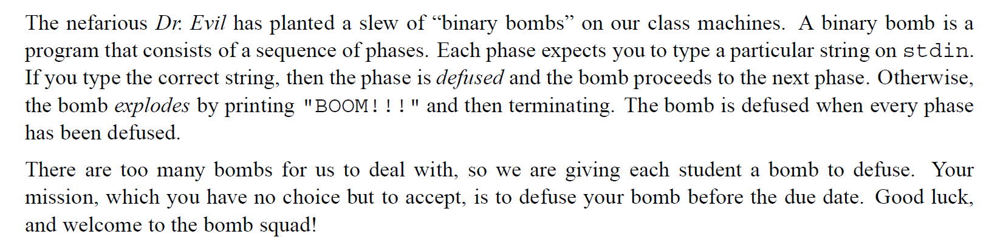

简单来说：二进制炸弹文件`bomb`包含若干个阶段，每个阶段需要输入特定的字符串，所有输入正确则炸弹被排除，否则爆炸，我们的任务是找出这些字符串。

我使用的是csapp官网所给的[bomb](http://csapp.cs.cmu.edu/3e/bomb.tar)。


## 二、实验步骤

1、使用`objdump`将`bomb`反汇编为`bomb.s`，便于后续操作

```shell
objdump -d bomb > bomb.s
```

2、得到汇编代码后仔细阅读，再使用`gdb`打断点一步步调试`bomb`文件。

```shell
gdb bomb
```


## 三、实验内容


### 3.1、phase_1

汇编代码如下：

```assembly
  400e28:	bf 78 23 40 00       	mov    $0x402378,%edi
  400e2d:	e8 de fc ff ff       	callq  400b10 <puts@plt>
  400e32:	e8 67 06 00 00       	callq  40149e <read_line>
  400e37:	48 89 c7             	mov    %rax,%rdi
  400e3a:	e8 a1 00 00 00       	callq  400ee0 <phase_1>
  400e3f:	e8 80 07 00 00       	callq  4015c4 <phase_defused>
```

程序接受用户输入字符串存入`rdi`中，再将`rdi`作为函数参数传给`phase_1`，再查看`phase_1`代码：

```assembly
0000000000400ee0 <phase_1>:
  400ee0:	48 83 ec 08          	sub    $0x8,%rsp
  400ee4:	be 00 24 40 00       	mov    $0x402400,%esi
  400ee9:	e8 4a 04 00 00       	callq  401338 <strings_not_equal>
  400eee:	85 c0                	test   %eax,%eax            # eax should be 0
  400ef0:	74 05                	je     400ef7 <phase_1+0x17>
  400ef2:	e8 43 05 00 00       	callq  40143a <explode_bomb>
  400ef7:	48 83 c4 08          	add    $0x8,%rsp
  400efb:	c3                   	retq   
```

首先观察这段代码，如果`eax`寄存器值为0则可拆除此阶段炸弹，`eax`保存着`<strings_not_equal>`函数的返回结果，所以需要检查`<strings_not_equal>`代码：

```assembly
0000000000401338 <strings_not_equal>:
  401338:	41 54                	push   %r12
  40133a:	55                   	push   %rbp
  40133b:	53                   	push   %rbx
  40133c:	48 89 fb             	mov    %rdi,%rbx
  40133f:	48 89 f5             	mov    %rsi,%rbp
  401342:	e8 d4 ff ff ff       	callq  40131b <string_length>
  401347:	41 89 c4             	mov    %eax,%r12d   # eax=0x1 [0x603680+1]=0 %eax means offset to zero
  40134a:	48 89 ef             	mov    %rbp,%rdi    # rdi=rbp
  40134d:	e8 c9 ff ff ff       	callq  40131b <string_length> # how many steps from [0x402400] to value of zero ->%eax
  401352:	ba 01 00 00 00       	mov    $0x1,%edx    #
  401357:	41 39 c4             	cmp    %eax,%r12d
  40135a:	75 3f                	jne    40139b <strings_not_equal+0x63>
  40135c:	0f b6 03             	movzbl (%rbx),%eax
  40135f:	84 c0                	test   %al,%al
  401361:	74 25                	je     401388 <strings_not_equal+0x50>
  401363:	3a 45 00             	cmp    0x0(%rbp),%al
  401366:	74 0a                	je     401372 <strings_not_equal+0x3a>
  401368:	eb 25                	jmp    40138f <strings_not_equal+0x57>
  40136a:	3a 45 00             	cmp    0x0(%rbp),%al
  40136d:	0f 1f 00             	nopl   (%rax)
  401370:	75 24                	jne    401396 <strings_not_equal+0x5e>
  401372:	48 83 c3 01          	add    $0x1,%rbx
  401376:	48 83 c5 01          	add    $0x1,%rbp
  40137a:	0f b6 03             	movzbl (%rbx),%eax
  40137d:	84 c0                	test   %al,%al
  40137f:	75 e9                	jne    40136a <strings_not_equal+0x32>
  401381:	ba 00 00 00 00       	mov    $0x0,%edx
  401386:	eb 13                	jmp    40139b <strings_not_equal+0x63>
  401388:	ba 00 00 00 00       	mov    $0x0,%edx
  40138d:	eb 0c                	jmp    40139b <strings_not_equal+0x63>
  40138f:	ba 01 00 00 00       	mov    $0x1,%edx
  401394:	eb 05                	jmp    40139b <strings_not_equal+0x63>
  401396:	ba 01 00 00 00       	mov    $0x1,%edx
  40139b:	89 d0                	mov    %edx,%eax
  40139d:	5b                   	pop    %rbx
  40139e:	5d                   	pop    %rbp
  40139f:	41 5c                	pop    %r12
  4013a1:	c3                   	retq   
```

继续看`<string_length>`函数代码

```assembly
000000000040131b <string_length>:
  40131b:	80 3f 00             	cmpb   $0x0,(%rdi)
  40131e:	74 12                	je     401332 <string_length+0x17>
  401320:	48 89 fa             	mov    %rdi,%rdx
  401323:	48 83 c2 01          	add    $0x1,%rdx
  401327:	89 d0                	mov    %edx,%eax
  401329:	29 f8                	sub    %edi,%eax
  40132b:	80 3a 00             	cmpb   $0x0,(%rdx)
  40132e:	75 f3                	jne    401323 <string_length+0x8>
  401330:	f3 c3                	repz retq 
  401332:	b8 00 00 00 00       	mov    $0x0,%eax
  401337:	c3                   	retq   
```

读了许久终于明白这两个函数的功能：

1. `strings_not_equal`判断输入的字符串是否与内存中某个字符串相等
2. `string_length`求字符串长度

由`mov  $0x402400,%esi`指令可以看出`<strings_not_equal>`函数至少接收两个参数，因为`rsi`寄存器保存第二个参数，查看代码并打断点查看发现果然如此，`rsi`保存着：

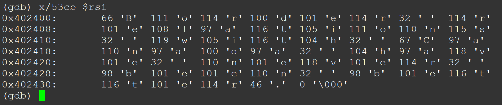

查看`rdi`保存着：

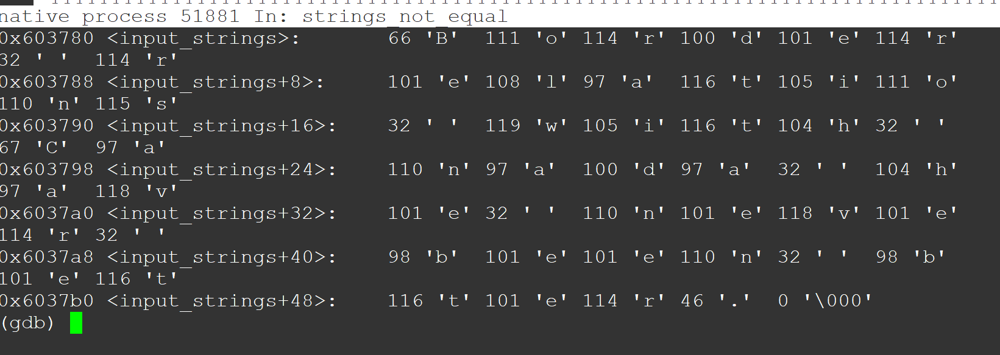

`phase_1`先判断`rdi`和`rsi`中字符串长度是否相同，如果相同再逐字符判断字符串整体是否相等，相等则正确返回，最后结果如下，成功拆除第一阶段：

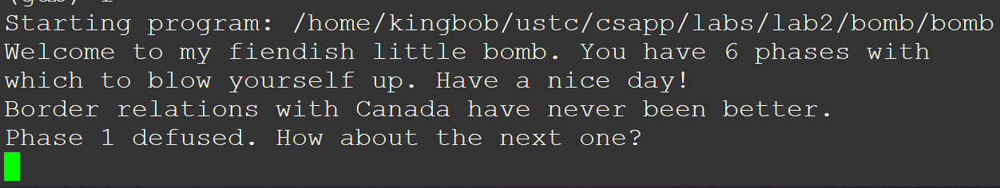


### 3.2、phase_2

```assembly
0000000000400efc <phase_2>:
  400efc:	55                   	push   %rbp
  400efd:	53                   	push   %rbx
  400efe:	48 83 ec 28          	sub    $0x28,%rsp
  400f02:	48 89 e6             	mov    %rsp,%rsi
  400f05:	e8 52 05 00 00       	callq  40145c <read_six_numbers>
  400f0a:	83 3c 24 01          	cmpl   $0x1,(%rsp)
  400f0e:	74 20                	je     400f30 <phase_2+0x34>
  400f10:	e8 25 05 00 00       	callq  40143a <explode_bomb>
  400f15:	eb 19                	jmp    400f30 <phase_2+0x34>
  400f17:	8b 43 fc             	mov    -0x4(%rbx),%eax
  400f1a:	01 c0                	add    %eax,%eax
  400f1c:	39 03                	cmp    %eax,(%rbx)
  400f1e:	74 05                	je     400f25 <phase_2+0x29>
  400f20:	e8 15 05 00 00       	callq  40143a <explode_bomb>
  400f25:	48 83 c3 04          	add    $0x4,%rbx
  400f29:	48 39 eb             	cmp    %rbp,%rbx
  400f2c:	75 e9                	jne    400f17 <phase_2+0x1b>
  400f2e:	eb 0c                	jmp    400f3c <phase_2+0x40>
  400f30:	48 8d 5c 24 04       	lea    0x4(%rsp),%rbx
  400f35:	48 8d 6c 24 18       	lea    0x18(%rsp),%rbp
  400f3a:	eb db                	jmp    400f17 <phase_2+0x1b>
  400f3c:	48 83 c4 28          	add    $0x28,%rsp
  400f40:	5b                   	pop    %rbx
  400f41:	5d                   	pop    %rbp
  400f42:	c3                   	retq   
```

`phase_2`调用了`read_six_numbers`，阅读该函数汇编代码：

```assembly
000000000040145c <read_six_numbers>:
  40145c:	48 83 ec 18          	sub    $0x18,%rsp
  401460:	48 89 f2             	mov    %rsi,%rdx
  401463:	48 8d 4e 04          	lea    0x4(%rsi),%rcx
  401467:	48 8d 46 14          	lea    0x14(%rsi),%rax
  40146b:	48 89 44 24 08       	mov    %rax,0x8(%rsp)
  401470:	48 8d 46 10          	lea    0x10(%rsi),%rax
  401474:	48 89 04 24          	mov    %rax,(%rsp)
  401478:	4c 8d 4e 0c          	lea    0xc(%rsi),%r9
  40147c:	4c 8d 46 08          	lea    0x8(%rsi),%r8
  401480:	be c3 25 40 00       	mov    $0x4025c3,%esi
  401485:	b8 00 00 00 00       	mov    $0x0,%eax
  40148a:	e8 61 f7 ff ff       	callq  400bf0 <__isoc99_sscanf@plt>
  40148f:	83 f8 05             	cmp    $0x5,%eax
  401492:	7f 05                	jg     401499 <read_six_numbers+0x3d>
  401494:	e8 a1 ff ff ff       	callq  40143a <explode_bomb>
  401499:	48 83 c4 18          	add    $0x18,%rsp
  40149d:	c3                   	retq   
```

注意到`read_six_numbers`中有个内存地址`0x4025c3`，用`gdb`查看该内存地址内容，发现是6个`%d`，所以该函数读入6个数字。

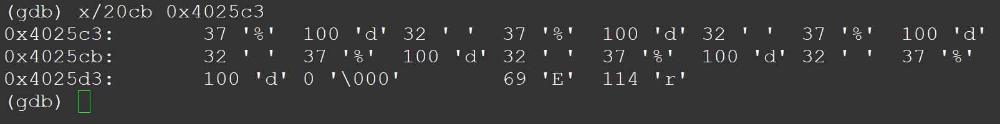

`phase_2`读入6个数字，并存储在栈中，利用了一个循环来判断数字是否符合设定；循环判断输入的后一项是否等于前一项的两倍，不相等就 `explode_bomb` ，循环的汇编代码如下：

```assembly
  400f17:	8b 43 fc             	mov    -0x4(%rbx),%eax
  400f1a:	01 c0                	add    %eax,%eax
  400f1c:	39 03                	cmp    %eax,(%rbx)
  400f1e:	74 05                	je     400f25 <phase_2+0x29>
  400f20:	e8 15 05 00 00       	callq  40143a <explode_bomb>
  400f25:	48 83 c3 04          	add    $0x4,%rbx
  400f29:	48 39 eb             	cmp    %rbp,%rbx
  400f2c:	75 e9                	jne    400f17 <phase_2+0x1b>
  400f2e:	eb 0c                	jmp    400f3c <phase_2+0x40>
```

注意到这个`add    %eax,%eax`，刚开始我把它看成`eax++`，结果在这卡了许久才发现原来是`eax*=2`。。。

```assembly
  400f05:	e8 52 05 00 00       	callq  40145c <read_six_numbers>
  400f0a:	83 3c 24 01          	cmpl   $0x1,(%rsp)
  400f0e:	74 20                	je     400f30 <phase_2+0x34>
  400f10:	e8 25 05 00 00       	callq  40143a <explode_bomb>
```

而由上面的代码可知，读入的第一个数需要是1，否则直接爆炸，最后构成一个公比是2的等比数列。所以答案是`1 2 4 8 16 32`

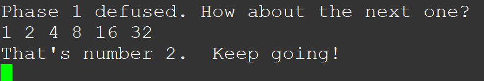


### 3.3、phase_3

```assembly
0000000000400f43 <phase_3>:
  400f43:	48 83 ec 18          	sub    $0x18,%rsp
  400f47:	48 8d 4c 24 0c       	lea    0xc(%rsp),%rcx
  400f4c:	48 8d 54 24 08       	lea    0x8(%rsp),%rdx
  400f51:	be cf 25 40 00       	mov    $0x4025cf,%esi
  400f56:	b8 00 00 00 00       	mov    $0x0,%eax
  400f5b:	e8 90 fc ff ff       	callq  400bf0 <__isoc99_sscanf@plt>
  400f60:	83 f8 01             	cmp    $0x1,%eax
  400f63:	7f 05                	jg     400f6a <phase_3+0x27>
  400f65:	e8 d0 04 00 00       	callq  40143a <explode_bomb>
  400f6a:	83 7c 24 08 07       	cmpl   $0x7,0x8(%rsp)
  400f6f:	77 3c                	ja     400fad <phase_3+0x6a>
  400f71:	8b 44 24 08          	mov    0x8(%rsp),%eax
  400f75:	ff 24 c5 70 24 40 00 	jmpq   *0x402470(,%rax,8)
  400f7c:	b8 cf 00 00 00       	mov    $0xcf,%eax
  400f81:	eb 3b                	jmp    400fbe <phase_3+0x7b>
  400f83:	b8 c3 02 00 00       	mov    $0x2c3,%eax
  400f88:	eb 34                	jmp    400fbe <phase_3+0x7b>
  400f8a:	b8 00 01 00 00       	mov    $0x100,%eax
  400f8f:	eb 2d                	jmp    400fbe <phase_3+0x7b>
  400f91:	b8 85 01 00 00       	mov    $0x185,%eax
  400f96:	eb 26                	jmp    400fbe <phase_3+0x7b>
  400f98:	b8 ce 00 00 00       	mov    $0xce,%eax
  400f9d:	eb 1f                	jmp    400fbe <phase_3+0x7b>
  400f9f:	b8 aa 02 00 00       	mov    $0x2aa,%eax
  400fa4:	eb 18                	jmp    400fbe <phase_3+0x7b>
  400fa6:	b8 47 01 00 00       	mov    $0x147,%eax
  400fab:	eb 11                	jmp    400fbe <phase_3+0x7b>
  400fad:	e8 88 04 00 00       	callq  40143a <explode_bomb>
  400fb2:	b8 00 00 00 00       	mov    $0x0,%eax
  400fb7:	eb 05                	jmp    400fbe <phase_3+0x7b>
  400fb9:	b8 37 01 00 00       	mov    $0x137,%eax
  400fbe:	3b 44 24 0c          	cmp    0xc(%rsp),%eax
  400fc2:	74 05                	je     400fc9 <phase_3+0x86>
  400fc4:	e8 71 04 00 00       	callq  40143a <explode_bomb>
  400fc9:	48 83 c4 18          	add    $0x18,%rsp
  400fcd:	c3                   	retq   
```

`phase_3`中出现了`sscanf`，且在该函数前出现了地址`0x4025cf`，查看该地址内容：显然需要读取两个数字。

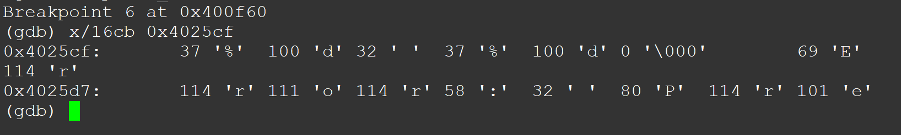

阅读分析可知：这类似于`switch`语句，由`cmpl   $0x7,0x8(%rsp)`可知输入的第一个数字应该小于等于7，因此可以写出如下`switch`语句：

```c
switch(x){ //y表示输入的第二个数
    case 0:
        y == 0xcf;
    case 1:
        y == 0x2c3;
    case 2:
        y == 0x100;
    case 3:
        y == 0x185;
    case 4:
        y == 0xce;
    case 5:
        y == 0x2aa;
    case 6:
        y == 0x147;
    case 7:
        y == 0x0;
}
```

随便输入一组数字即可，比如`3 256`，结果如下：成功拆除！

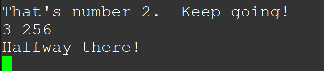


### 3.4、phase_4

```assembly
000000000040100c <phase_4>:
  40100c:	48 83 ec 18          	sub    $0x18,%rsp
  401010:	48 8d 4c 24 0c       	lea    0xc(%rsp),%rcx
  401015:	48 8d 54 24 08       	lea    0x8(%rsp),%rdx
  40101a:	be cf 25 40 00       	mov    $0x4025cf,%esi
  40101f:	b8 00 00 00 00       	mov    $0x0,%eax
  401024:	e8 c7 fb ff ff       	callq  400bf0 <__isoc99_sscanf@plt>
  401029:	83 f8 02             	cmp    $0x2,%eax
  40102c:	75 07                	jne    401035 <phase_4+0x29>
  40102e:	83 7c 24 08 0e       	cmpl   $0xe,0x8(%rsp)
  401033:	76 05                	jbe    40103a <phase_4+0x2e>
  401035:	e8 00 04 00 00       	callq  40143a <explode_bomb>
  40103a:	ba 0e 00 00 00       	mov    $0xe,%edx
  40103f:	be 00 00 00 00       	mov    $0x0,%esi
  401044:	8b 7c 24 08          	mov    0x8(%rsp),%edi
  401048:	e8 81 ff ff ff       	callq  400fce <func4>
  40104d:	85 c0                	test   %eax,%eax
  40104f:	75 07                	jne    401058 <phase_4+0x4c>
  401051:	83 7c 24 0c 00       	cmpl   $0x0,0xc(%rsp)
  401056:	74 05                	je     40105d <phase_4+0x51>
  401058:	e8 dd 03 00 00       	callq  40143a <explode_bomb>
  40105d:	48 83 c4 18          	add    $0x18,%rsp
  401061:	c3                   	retq   
```

这个阶段同样需要输入两个数字，其中的`func4`分析可知是个递归函数，我根据汇编写了个伪代码：

```c
func4(a,b,c)
{
	ret=c;
	ret-=b;
	ret+=(ret>>31)//logical右移
	ret>>=1;
	ecx=ret+b;
	if(ecx<=a)
	{
		if(ecx==a)return 0;	//?????
		else{	
			func(a,a1+1,c);
			return 2*ret+1;
		}				
	}
	else
	{
		c=ecx-1;
		func(a,b,c);//func(a,b,ret+b-1);
		return ret*2;
	}
}
```

在`phase_4`里会给`func`传入三个参数，`mov    $0xe,%edx 和 mov    $0x0,%esi`，也就是调用`func4(x, 0, 14)`，在`func4`中前几行对`ecx`进行处理，`temp=c-b; temp+=(temp>>31) ecx=temp+b`，可以得到`temp=7`，如果`temp==a`则直接返回，炸弹拆除，即第一个输入数字为7，第二个必须是0，当时我以为是个彩蛋，莫名其妙就解出来了，也就没继续往下想了。结果如下：

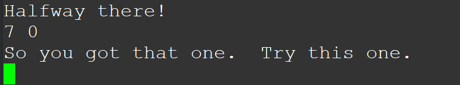


### 3.5、phase_5

```assembly
0000000000401062 <phase_5>:
  401062:	53                   	push   %rbx
  401063:	48 83 ec 20          	sub    $0x20,%rsp
  401067:	48 89 fb             	mov    %rdi,%rbx
  40106a:	64 48 8b 04 25 28 00 	mov    %fs:0x28,%rax
  401071:	00 00 
  401073:	48 89 44 24 18       	mov    %rax,0x18(%rsp)
  401078:	31 c0                	xor    %eax,%eax
  40107a:	e8 9c 02 00 00       	callq  40131b <string_length>
  40107f:	83 f8 06             	cmp    $0x6,%eax
  401082:	74 4e                	je     4010d2 <phase_5+0x70>
  401084:	e8 b1 03 00 00       	callq  40143a <explode_bomb>
  401089:	eb 47                	jmp    4010d2 <phase_5+0x70>
  40108b:	0f b6 0c 03          	movzbl (%rbx,%rax,1),%ecx
  40108f:	88 0c 24             	mov    %cl,(%rsp)
  401092:	48 8b 14 24          	mov    (%rsp),%rdx
  401096:	83 e2 0f             	and    $0xf,%edx
  401099:	0f b6 92 b0 24 40 00 	movzbl 0x4024b0(%rdx),%edx
  4010a0:	88 54 04 10          	mov    %dl,0x10(%rsp,%rax,1)
  4010a4:	48 83 c0 01          	add    $0x1,%rax
  4010a8:	48 83 f8 06          	cmp    $0x6,%rax
  4010ac:	75 dd                	jne    40108b <phase_5+0x29>
  4010ae:	c6 44 24 16 00       	movb   $0x0,0x16(%rsp)
  4010b3:	be 5e 24 40 00       	mov    $0x40245e,%esi
  4010b8:	48 8d 7c 24 10       	lea    0x10(%rsp),%rdi
  4010bd:	e8 76 02 00 00       	callq  401338 <strings_not_equal>
  4010c2:	85 c0                	test   %eax,%eax
  4010c4:	74 13                	je     4010d9 <phase_5+0x77>
  4010c6:	e8 6f 03 00 00       	callq  40143a <explode_bomb>
  4010cb:	0f 1f 44 00 00       	nopl   0x0(%rax,%rax,1)
  4010d0:	eb 07                	jmp    4010d9 <phase_5+0x77>
  4010d2:	b8 00 00 00 00       	mov    $0x0,%eax
  4010d7:	eb b2                	jmp    40108b <phase_5+0x29>
  4010d9:	48 8b 44 24 18       	mov    0x18(%rsp),%rax
  4010de:	64 48 33 04 25 28 00 	xor    %fs:0x28,%rax
  4010e5:	00 00 
  4010e7:	74 05                	je     4010ee <phase_5+0x8c>
  4010e9:	e8 42 fa ff ff       	callq  400b30 <__stack_chk_fail@plt>
  4010ee:	48 83 c4 20          	add    $0x20,%rsp
  4010f2:	5b                   	pop    %rbx
  4010f3:	c3                   	retq
```

`phase_5`同样调用了`strings_not_equal`，所以内存中肯定也隐藏着一个字符串需要去比对，果然观察代码：

```assembly
  4010ae:	c6 44 24 16 00       	movb   $0x0,0x16(%rsp)
  4010b3:	be 5e 24 40 00       	mov    $0x40245e,%esi
  4010b8:	48 8d 7c 24 10       	lea    0x10(%rsp),%rdi
  4010bd:	e8 76 02 00 00       	callq  401338 <strings_not_equal>
  4010c2:	85 c0                	test   %eax,%eax
  4010c4:	74 13                	je     4010d9 <phase_5+0x77>
  4010c6:	e8 6f 03 00 00       	callq  40143a <explode_bomb>
```

`strings_not_equal`被传入两个参数，其中一个是存在内存里的，查看`0x40245e`处数据，发现字符串“**flyers**”（又被Dr. Evil嘲讽了一次:angry:

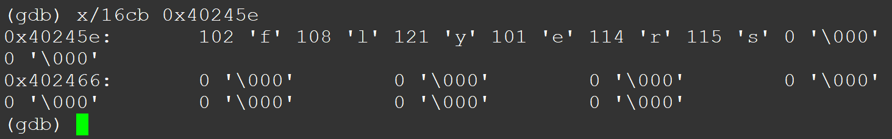

从头开始看`phase_5`，发现有个循环语句对我们输入的每个字符都会做`&0xf`操作，即取后四位并作为内存中某个地址的偏移量存入`edx`中，`movzbl 0x4024b0(%rdx),%edx`，查看`0x4024b0`处内容如下图：

```assembly
 40108b:	0f b6 0c 03          	movzbl (%rbx,%rax,1),%ecx
  40108f:	88 0c 24             	mov    %cl,(%rsp)
  401092:	48 8b 14 24          	mov    (%rsp),%rdx
  401096:	83 e2 0f             	and    $0xf,%edx
  401099:	0f b6 92 b0 24 40 00 	movzbl 0x4024b0(%rdx),%edx
  4010a0:	88 54 04 10          	mov    %dl,0x10(%rsp,%rax,1)
  4010a4:	48 83 c0 01          	add    $0x1,%rax
  4010a8:	48 83 f8 06          	cmp    $0x6,%rax
  4010ac:	75 dd                	jne    40108b <phase_5+0x29>
```

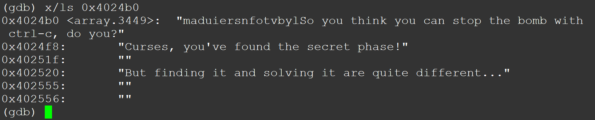

`0x4024b0`处数据正好有个16个字符的字符串，这才解释了为什么上面代码的循环中需要对每个输入字符做`& 0xf`操作，与的结果最多有16种，正好是这个16个字符，同时这串字符后的内容又蕴含着彩蛋，写报告之前我还没发现原来这里藏着`secret phase`的提示:yum:。

发现这一串字符之后，便能弄清楚`phase_5`的操作了，即输入6个字符后取每个字符的后四位作为偏移量，从`maduiersnfotvbyl`中找到相应偏移量的字符，存入`0x10(%rsp)`中。再判断转换后的字符串和`flyers`是否相等。

`flyers`在`maduiersnfotvbyl`中的偏移量为`9 f e 5 6 7`，所以随便找6个字符，其`ASCII`码后4位是`9 f e 5 6 7`即可，如：`9on567`即为正确答案：

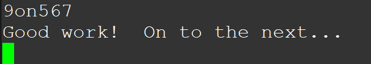


### 3.6、phase_6

```assembly
00000000004010f4 <phase_6>:
  4010f4:	41 56                	push   %r14
  4010f6:	41 55                	push   %r13
  4010f8:	41 54                	push   %r12
  4010fa:	55                   	push   %rbp
  4010fb:	53                   	push   %rbx
  4010fc:	48 83 ec 50          	sub    $0x50,%rsp
  401100:	49 89 e5             	mov    %rsp,%r13
  401103:	48 89 e6             	mov    %rsp,%rsi
  401106:	e8 51 03 00 00       	callq  40145c <read_six_numbers>
  40110b:	49 89 e6             	mov    %rsp,%r14
  40110e:	41 bc 00 00 00 00    	mov    $0x0,%r12d
  401114:	4c 89 ed             	mov    %r13,%rbp
  401117:	41 8b 45 00          	mov    0x0(%r13),%eax
  40111b:	83 e8 01             	sub    $0x1,%eax
  40111e:	83 f8 05             	cmp    $0x5,%eax
  401121:	76 05                	jbe    401128 <phase_6+0x34>
  401123:	e8 12 03 00 00       	callq  40143a <explode_bomb>
  401128:	41 83 c4 01          	add    $0x1,%r12d
  40112c:	41 83 fc 06          	cmp    $0x6,%r12d
  401130:	74 21                	je     401153 <phase_6+0x5f>
  401132:	44 89 e3             	mov    %r12d,%ebx
  401135:	48 63 c3             	movslq %ebx,%rax
  401138:	8b 04 84             	mov    (%rsp,%rax,4),%eax
  40113b:	39 45 00             	cmp    %eax,0x0(%rbp)
  40113e:	75 05                	jne    401145 <phase_6+0x51>
  401140:	e8 f5 02 00 00       	callq  40143a <explode_bomb>
  401145:	83 c3 01             	add    $0x1,%ebx
  401148:	83 fb 05             	cmp    $0x5,%ebx
  40114b:	7e e8                	jle    401135 <phase_6+0x41>
  40114d:	49 83 c5 04          	add    $0x4,%r13
  401151:	eb c1                	jmp    401114 <phase_6+0x20>
  401153:	48 8d 74 24 18       	lea    0x18(%rsp),%rsi
  401158:	4c 89 f0             	mov    %r14,%rax
  40115b:	b9 07 00 00 00       	mov    $0x7,%ecx
  401160:	89 ca                	mov    %ecx,%edx
  401162:	2b 10                	sub    (%rax),%edx
  401164:	89 10                	mov    %edx,(%rax)
  401166:	48 83 c0 04          	add    $0x4,%rax
  40116a:	48 39 f0             	cmp    %rsi,%rax
  40116d:	75 f1                	jne    401160 <phase_6+0x6c>
  40116f:	be 00 00 00 00       	mov    $0x0,%esi
  401174:	eb 21                	jmp    401197 <phase_6+0xa3>
  401176:	48 8b 52 08          	mov    0x8(%rdx),%rdx
  40117a:	83 c0 01             	add    $0x1,%eax
  40117d:	39 c8                	cmp    %ecx,%eax
  40117f:	75 f5                	jne    401176 <phase_6+0x82>
  401181:	eb 05                	jmp    401188 <phase_6+0x94>
  401183:	ba d0 32 60 00       	mov    $0x6032d0,%edx
  401188:	48 89 54 74 20       	mov    %rdx,0x20(%rsp,%rsi,2)
  40118d:	48 83 c6 04          	add    $0x4,%rsi
  401191:	48 83 fe 18          	cmp    $0x18,%rsi
  401195:	74 14                	je     4011ab <phase_6+0xb7>
  401197:	8b 0c 34             	mov    (%rsp,%rsi,1),%ecx
  40119a:	83 f9 01             	cmp    $0x1,%ecx  // the only cmp 0x1, %ecx
  40119d:	7e e4                	jle    401183 <phase_6+0x8f>
  40119f:	b8 01 00 00 00       	mov    $0x1,%eax
  4011a4:	ba d0 32 60 00       	mov    $0x6032d0,%edx
  4011a9:	eb cb                	jmp    401176 <phase_6+0x82>
  4011ab:	48 8b 5c 24 20       	mov    0x20(%rsp),%rbx
  4011b0:	48 8d 44 24 28       	lea    0x28(%rsp),%rax
  4011b5:	48 8d 74 24 50       	lea    0x50(%rsp),%rsi
  4011ba:	48 89 d9             	mov    %rbx,%rcx
  4011bd:	48 8b 10             	mov    (%rax),%rdx
  4011c0:	48 89 51 08          	mov    %rdx,0x8(%rcx)
  4011c4:	48 83 c0 08          	add    $0x8,%rax
  4011c8:	48 39 f0             	cmp    %rsi,%rax
  4011cb:	74 05                	je     4011d2 <phase_6+0xde>
  4011cd:	48 89 d1             	mov    %rdx,%rcx
  4011d0:	eb eb                	jmp    4011bd <phase_6+0xc9>
  4011d2:	48 c7 42 08 00 00 00 	movq   $0x0,0x8(%rdx)
  4011d9:	00 
  4011da:	bd 05 00 00 00       	mov    $0x5,%ebp
  4011df:	48 8b 43 08          	mov    0x8(%rbx),%rax
  4011e3:	8b 00                	mov    (%rax),%eax
  4011e5:	39 03                	cmp    %eax,(%rbx)
  4011e7:	7d 05                	jge    4011ee <phase_6+0xfa>
  4011e9:	e8 4c 02 00 00       	callq  40143a <explode_bomb>
  4011ee:	48 8b 5b 08          	mov    0x8(%rbx),%rbx
  4011f2:	83 ed 01             	sub    $0x1,%ebp
  4011f5:	75 e8                	jne    4011df <phase_6+0xeb>
  4011f7:	48 83 c4 50          	add    $0x50,%rsp
  4011fb:	5b                   	pop    %rbx
  4011fc:	5d                   	pop    %rbp
  4011fd:	41 5c                	pop    %r12
  4011ff:	41 5d                	pop    %r13
  401201:	41 5e                	pop    %r14
  401203:	c3                   	retq   
```

第六阶段代码实在是太长了，做了大半天才做出来:sob:。

首先读入6个数字，并循环判断这6个数是否都小于等于6，并且都各不相同，也就是输入1到6的一个全排列：

```assembly
  401114:       4c 89 ed                mov    %r13,%rbp
  401117:       41 8b 45 00             mov    0x0(%r13),%eax
  40111b:       83 e8 01                sub    $0x1,%eax
  40111e:       83 f8 05                cmp    $0x5,%eax
  401121:       76 05                   jbe    401128 <phase_6+0x34>
  401123:       e8 12 03 00 00          callq  40143a <explode_bomb>
  401128:       41 83 c4 01             add    $0x1,%r12d
  40112c:       41 83 fc 06             cmp    $0x6,%r12d
  401130:       74 21                   je     401153 <phase_6+0x5f>
  401132:       44 89 e3                mov    %r12d,%ebx
  401135:       48 63 c3                movslq %ebx,%rax
  401138:       8b 04 84                mov    (%rsp,%rax,4),%eax
  40113b:       39 45 00                cmp    %eax,0x0(%rbp)
  40113e:       75 05                   jne    401145 <phase_6+0x51>
  401140:       e8 f5 02 00 00          callq  40143a <explode_bomb>
  401145:       83 c3 01                add    $0x1,%ebx
  401148:       83 fb 05                cmp    $0x5,%ebx
  40114b:       7e e8                   jle    401135 <phase_6+0x41>
  40114d:       49 83 c5 04             add    $0x4,%r13
  401151:       eb c1                   jmp    401114 <phase_6+0x20>
```

设输入的数为`a[i]`，再进行`a[i]=7-a[i]`操作：

```assembly
  401153:       48 8d 74 24 18          lea    0x18(%rsp),%rsi
  401158:       4c 89 f0                mov    %r14,%rax
  40115b:       b9 07 00 00 00          mov    $0x7,%ecx
  401160:       89 ca                   mov    %ecx,%edx
  401162:       2b 10                   sub    (%rax),%edx
  401164:       89 10                   mov    %edx,(%rax)
  401166:       48 83 c0 04             add    $0x4,%rax
  40116a:       48 39 f0                cmp    %rsi,%rax
  40116d:       75 f1                   jne    401160 <phase_6+0x6c>
```

然后每次`b[i]`存入`[rsp+0x20+2*rsi]`中，而`b[i]`为地址`0x6032d0+8*a[i]`中的数据：

```assembly
  40116f:       be 00 00 00 00          mov    $0x0,%esi
  401174:       eb 21                   jmp    401197 <phase_6+0xa3>
  401176:       48 8b 52 08             mov    0x8(%rdx),%rdx
  40117a:       83 c0 01                add    $0x1,%eax
  40117d:       39 c8                   cmp    %ecx,%eax
  40117f:       75 f5                   jne    401176 <phase_6+0x82>
  401181:       eb 05                   jmp    401188 <phase_6+0x94>
  401183:       ba d0 32 60 00          mov    $0x6032d0,%edx
  401188:       48 89 54 74 20          mov    %rdx,0x20(%rsp,%rsi,2)
  40118d:       48 83 c6 04             add    $0x4,%rsi
  401191:       48 83 fe 18             cmp    $0x18,%rsi
  401195:       74 14                   je     4011ab <phase_6+0xb7>
  401197:       8b 0c 34                mov    (%rsp,%rsi,1),%ecx
  40119a:       83 f9 01                cmp    $0x1,%ecx
  40119d:       7e e4                   jle    401183 <phase_6+0x8f>
  40119f:       b8 01 00 00 00          mov    $0x1,%eax
  4011a4:       ba d0 32 60 00          mov    $0x6032d0,%edx
  4011a9:       eb cb                   jmp    401176 <phase_6+0x82>
```

查看地址`0x6032d0`，发现这里存着一个链表：

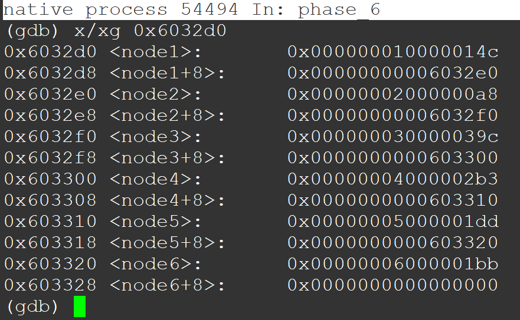

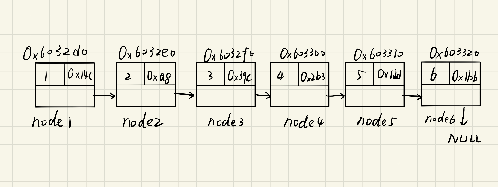

猜想这个链表结构体有三个数据项：`index, val, next`。接下来`phase_6`把以上面6个数为链表索引，取出相应的节点，并且重新组织`next`指针，前一个数的`next`是后一个数，然后遍历这个链表，判断是否是降序排列。一言以蔽之，`phase_6`实现的就是`4 3 2 1 6 5  (ai = 7-ai)=>(降序排列这6个节点)`。

因此，原链表按照`val`降序排列的索引序列为`3 4 5 6 1 2`，用7减去索引，得到最终答案的6个数：`4 3 2 1 6 5`。

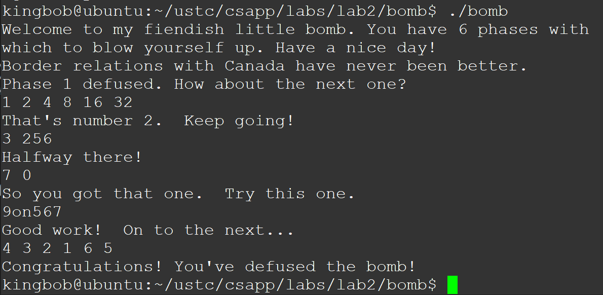


## 四、实验总结

`phase_6`做了大半天，终于独立解出来了！因为当时太过兴奋和疲惫，没有再去思考`secret_phase`。不管怎样，不愧是`boomlab`，越做越令人兴奋，拆炸弹的过程让我学会了很多`gdb`调试技巧和汇编知识，同时我也越来越明确自己的兴趣所在。

